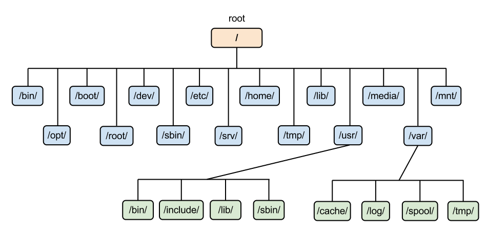
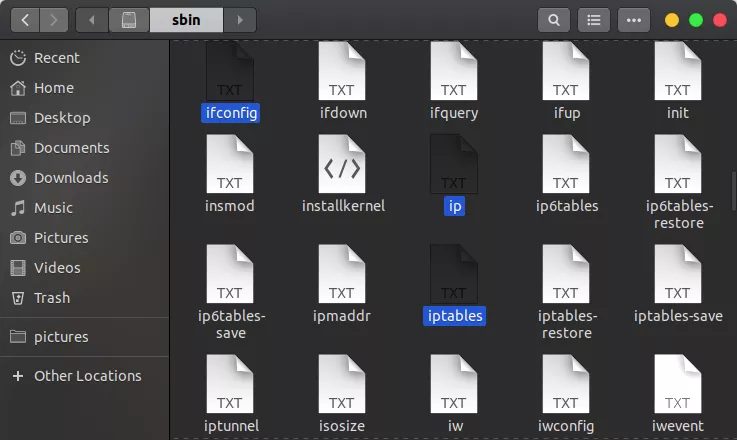
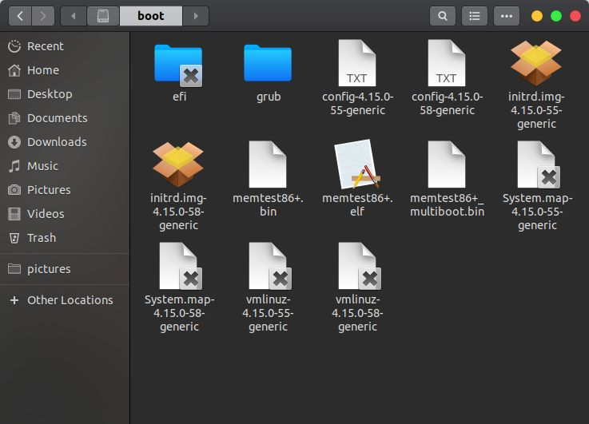
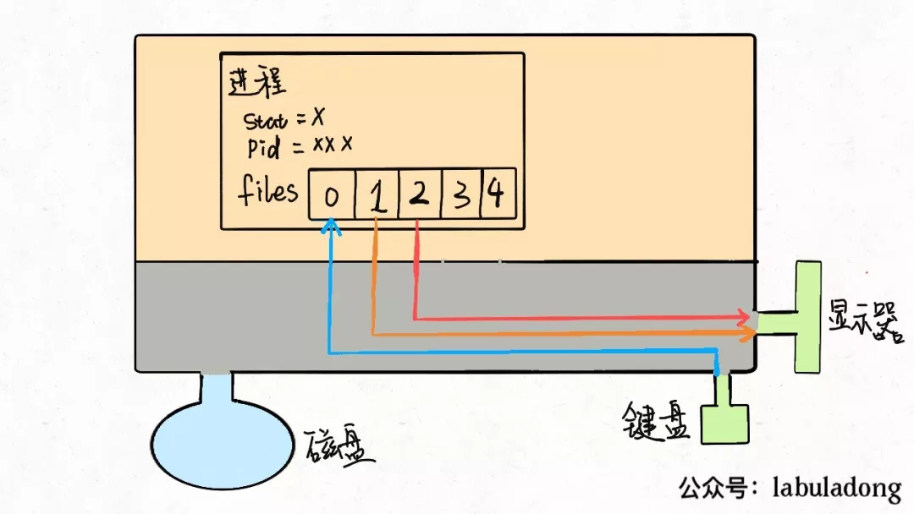
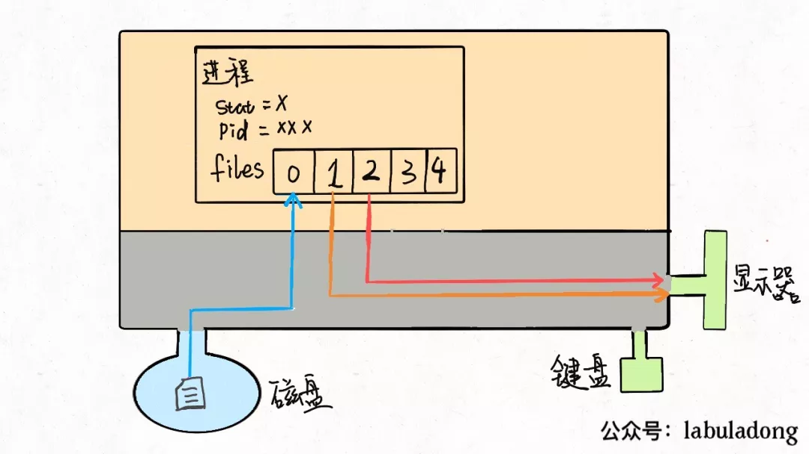
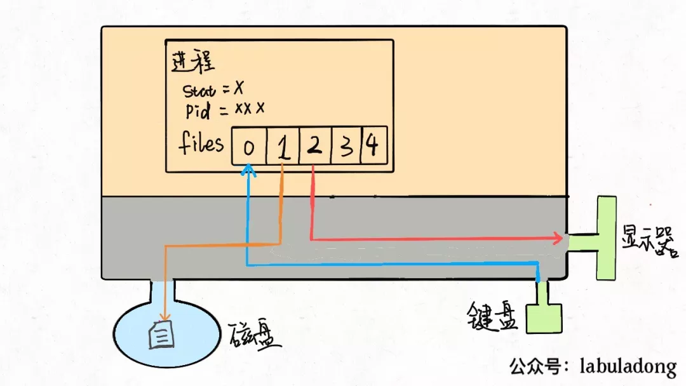
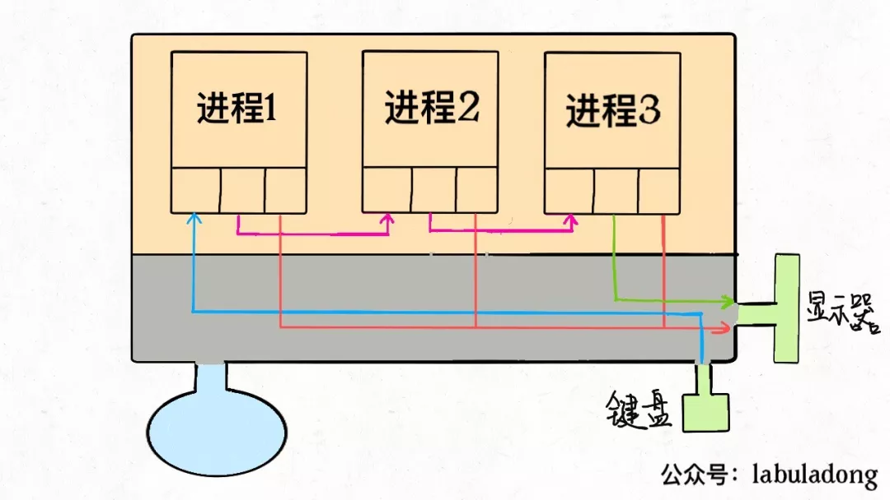
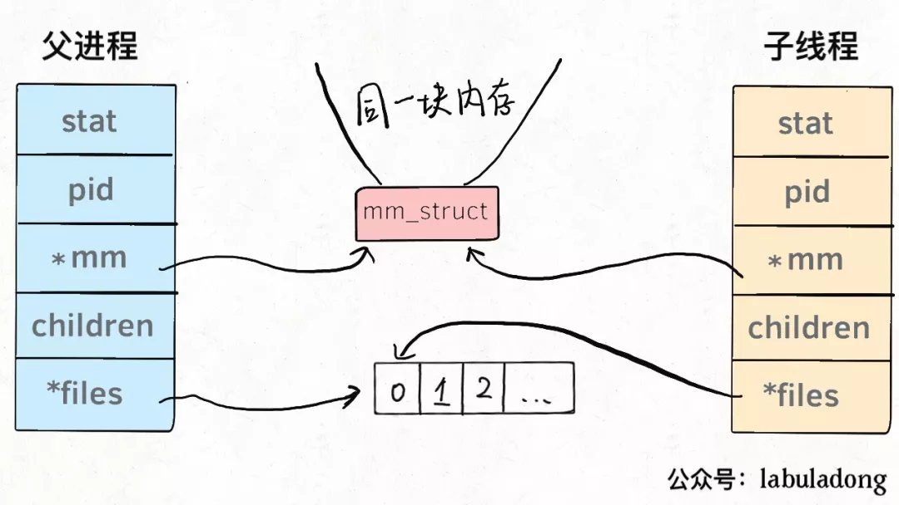

## Linux & shell

### Linux 文件系统



#### 1、根目录 /

- 整个 Linux 文件系统的根部

#### 2、/bin 和 /sbin




- bin，binary 的缩写；存放的是可执行文件 or 可执行文件的链接（类似 Windows 下的快捷方式）

- Linux 不按后缀名识别文件，可以用 `file` 命令查看文件类型
- sbin，System  Binary 的缩写，类似 bin 目录；存放可以对系统配置进行操作的命令（普通用户可查看系统状态；更改配置需提权）

#### 3、/boot



- 存放系统启动所需文件；`grub` 目录，常见的开机引导程序；SP 相关，一般情况下勿动

#### 4、/dev

![[webp-to-png output image]](linux_shell.assets/dev.png)

- 存放设备文件；磁盘、鼠标、键盘等硬件设备

#### 5、/etc

- 存放程序的配置信息
  - apt -> /etc/apt/
  - yum -> /etc/yum.repos.d/
  - rsyslog -> /etc/rsyslog.conf 和 /etc/rsyslog.d/
  - logrotate -> /etc/logrotate.conf 和 /etc/logrotate.d/
  - crond -> /etc/cron.d、/etc/cron.hourly、/etc/cron.daily、/etc/cron.weekly、/etc/cron.monthly 等
  - ......

#### 6、/lib

- lib，Library 的缩写，存放 /bin 和 /sbin 目录中可执行文件的依赖
- /lib32 和 /lib64，作用和 /lib 类似

#### 7、/media

- 存在一个以你用户名命名的目录，里面是自动挂载的设备，比如 U 盘，移动硬盘等

#### 8、/mnt

- 一般是空目录，是手动挂载设备的地方
- /dev 目录下的设备可挂载到 /mnt 目录下进行操作

#### 9、/opt

- opt，Option 的缩写，使用比较随意；一般自己下载的软件 ，可以安装在这里
- iBMA 安装在 /opt/huawei/ibma 目录下

#### 10、/proc

- proc，process 的缩写，存放的是系统正在运行的程序（进程）的状态信息
- 有一堆以数字命名的目录，每个目录对应一个进程，数字即为进程 ID
- 可以通过 /proc/<process_id>/ 目录下的文件查看该进程执行的命令，在哪个目录下执行等信息

#### 11、/root

- 超级用户的 home 目录，普通用户需授权才能访问
- /root 和根目录的区别： root 用户是 Linux 系统的超级用户，/root 目录是其 home 目录；根目录是 `/` 目录，是整个文件系统的根部

#### 12、/run 和 /sys

- 存放某些程序运行时信息和系统所需信息

- 数据存储在内存中，系统重启后，信息会丢失；不要试图在这里存放文件

#### 13、/srv

- srv，service 的缩写；存放服务数据
- 桌面版 LInux，该目录一般为空；对于 LInux 服务器，Web 服务、文件服务等资源可存放在这里

#### 14、/tmp

- tmp，temporary 的缩写；存放临时文件
- 某些程序会在该目录下存放一份当前操作文件的拷贝
- 系统重启后会被自动清空

#### 15、/usr


- usr，Universal System Resource 的缩写；存放系统非必需的资源，如用户安装的应用程序
- /usr 和 /usr/local 目录下又含有 bin 和 sbin 目录，存放用户使用而非系统必须使用的命令

#### 16、/var

- var，variable 的缩写；名字历史遗留，现在主要用于存储日志（/var/log 目录）
- 存放在 /var/log 目录下的日志不会删除；因此为防止日志不断增加，占用系统空间，通常会对其进行日志滚动，即 rotate

#### 17、/home

- 普通用户的家目录，用户的家目录（/home/<user_name>）通常会有 Desktop、Downloads 等目录
- 一些重要的隐藏文件 / 目录（以 `.` 开头的文件 / 目录）
  - .cache 目录，存放缓存数据
  - .config 目录，存放程序的配置；某些程序的配置文件不存放在该目录，而是存放在自己创建的隐藏目录下
  - .local 目录，类似 /usr/local，存放可执行文件；如 pip 安装的一些工具，就存放在 .local/bin 目录下
  - .bashrc、.profile 等文件，登录该用户时会去执行这些文件
  - .history 文件，存放执行过的命令

#### 总结

- 修改系统配置 -> /etc（普通用户需提权）

- 修改用户的某个应用程序的配置 -> 用户家目录的隐藏文件

- 能在命令行中直接使用的命令，通常位于下面的目录中

  ```bash
  /bin    
  /sbin
  /usr/bin
  /usr/sbin
  /usr/local/bin
  /usr/local/sbin
  /home/USER/.local/bin
  /home/USER/.local/sbin
  ```

- 某个程序崩溃了 -> /var/log 目录下查看日志 or /tmp 目录下寻找残留的临时文件
- 系统设备文件是在 /dev 目录，通常系统会自动挂载 U 盘之类的设备的 /media 目录；手动挂载镜像可以选择 /mnt 目录

### Linux 进程、文件描述符、重定向和管道

#### 1、操作系统内存空间


- 整个大矩形就是内存空间，小矩形代表进程；左下角圆形代表磁盘，右下角表示鼠标、键盘、显示器等输入输出设备
- 整个内存空间被划分成两块：用户空间和内核空间
- 用户空间存放用户进程所需资源；内核空间存放系统进程所需资源，通常用户无法直接访问；某些用户进程会共享内核资源

- 程序是如何运行的
  - 用 C 语言编写一个 Hello World 程序，编译成可执行的二进制文件，在命令行里调用就会打印
  - 从 OS 角度看：系统创建了一个进程，将可执行文件加载到内存空间，执行，退出
  - 可执行程序是文件，不是进程；程序必须加载到内存，包装成一个进程才能执行
  - 进程是由 OS 创建的，每个进程有它的固有属性，如进程 ID，进程状态，打开的文件等

#### 2、进程描述符

- Linux 内核源码中关于进程的描述：

  ```c
  struct task_struct {
      // 进程状态
      long              state;
      // 虚拟内存结构体
      struct mm_struct  *mm;
      // 进程号
      pid_t             pid;
      // 指向父进程的指针
      struct task_struct   *parent;
      // 子进程列表
      struct list_head      children;
      // 存放文件系统信息的指针
      struct fs_struct      *fs;
      // 一个数组，包含该进程打开的文件指针
      struct files_struct   *files;
  };
  ```

- 从源码可以看出，进程其实就是一个数据结构，体现为 `task_struct` 结构体，包含了进程状态、进程 ID 等成员变量（属性）
- `mm` 指针指向进程的虚拟内存，用来加载系统资源和可执行文件；`files` 指针指向一个数组，包含了进程打开的文件的指针

#### 3、文件描述符



- 通常，进程会从 `files[0]` 读取输入，将输出写入 `files[1]`，将错误信息写入 `files[2]`
  - `printf` 函数向 `files[1]` 写入数据；`scanf` 函数从 `files[0]` 读取数据

- 进程创建时，`files[0]`，`files[1]`，`files[2]` 默认指向标准输入流、标准输出流和标准错误流

- 进程需要其他资源，如打开文件进行读写；通过系统调用，让内核把文件打开 -> `files[3]`

  

- 输入重定向：把 `files[0]` 指向一个文件，程序就会从该文件读取数据

  

- 输出重定向：把 `files[1]` 指向一个文件，程序就会把输出写入该文件

  

- 错误重定向同输出重定向

- 管道符

  

  - 管道：把进程 A 的输出流和进程 B 的输入流连起来的一条数据传递通道
  - `cat <file> | grep xxx`

#### 4、进程和线程




- 进程和线程都是通过 `task_struct` 结构来表示的，区别是共享的数据区域不同
- 多线程需要利用锁机制，防止多个线程同时往同一区域写数据，造成数据错乱

#### 5、重定向符和管道符的坑

1. 执行 `cat file.txt > file.txt` 或 `cat < file.txt > file.txt` 结果是什么

2. 说明结果和执行过程

3. 将命令改成 `cat file.txt >> file.txt` 会怎样

   ```bash
   echo xxx > file.txt
   cat file.txt >> file.txt
   ```

4. 说明结果和执行过程（类似于遍历列表的同时，往列表追加元素）
5. 需求：截取文件的前 xx 行
   - 使用命令 `head -n xx file.txt > file.txt` 会清空文件，原理同上
   - `>` 和 `|` 配合：`cat file.txt | head -n xx > file.txt`，文件依然被清空
   - 管道符连接的命令是串行执行的？❌
   - 通过命令 `data; sleep 5; sleep 5; date` 验证
   - `cat <file> | grep xxx` 不是串行执行吗？
   - 执行命令 `cat | grep xxx` 验证
   - 通过管道符连接的两条命令，谁先执行？

6. 解决方案

   - 不要同时对同一个文件进行读写，通过临时文件的方式做一个中转

     ```bash
     # 保留文件前 xx 行：
     head -n xx file.txt > tmp.txt && mv tmp.txt file.txt
     ```

   - 第三方工具 `moreutil` 包的 `sponge` 命令

     ```bash
     # 保留文件前 xx 行：
     head -n xx file.txt | sponge file.txt
     ```
